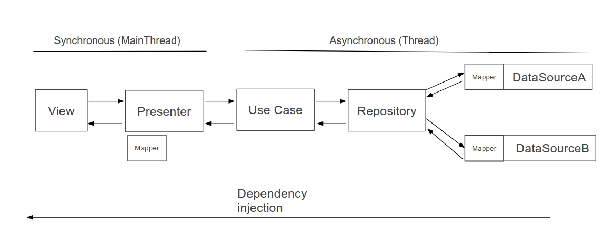
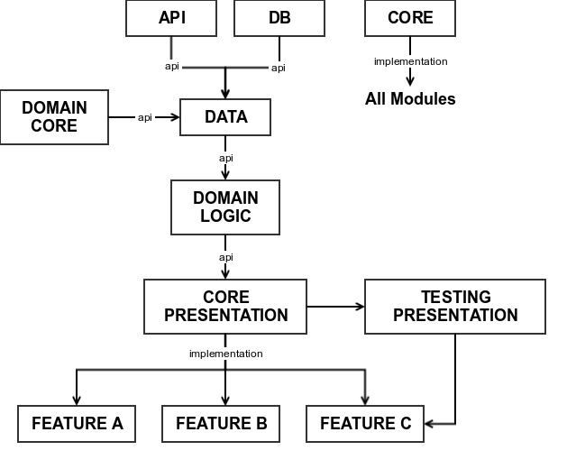

## MyTaxi test code by Adrián García Lomas

### Architecture

The selected architecture is Clean architecture with MVP pattern, you will found that the app is divided in many layers as follows:

### Modules organization

In order to improve the compilations times and the code organised i try an approach with several modules for features and shared code between features

- The team work, every team work on their own feature module

- Compilation time, just compile the module that changes

- Be prepared for future implementations like Instant Apps

###### Core
Core contains implementations related to whole project, like exceptions, extensions, utils and dependencies used by all the modules

###### API | DB
Just third party implementations like apis, databases, protocols like xmpp, websockets.

###### DATA
Repository implementations and data logic, the datasources make use of the third party implementations from api modules and transform the data to the domain model.

###### Domain Core
Just the domain models and the Repository interfaces

###### Domain Logic
Use case implementations, get the data from the repository and perform some operations related to application logic

###### Core Presentation
Is the base module for all the features, here are all the shared code like resources, Abstract implementations, utils, etc.

###### Testing Presentation
This base module contains all the necessary logic to do integration test in the features.

###### Features modules
Contains all the presenters, activities, fragments, viewModels, everything related with the presentation layer and the sdk

### Design and Custom views

All the design and custom views used in the project are developed by me.

### Testing

In this test code you will found three differents kind of test:

###### Unit test
- VehicleMapPresenterTest

###### Integration test
Integration test are for me one of the most important test in **Android Development**, despite unit test are useful the integration test check all functionality flows (mappers, data flows, etc)

- VehicleInfoPresenterIntegrationTest
- VehicleMapPresenterIntegrationTest
- VehicleListPresenterIntegrationTest

###### UI Test

- VehicleListNavigateToDetail
